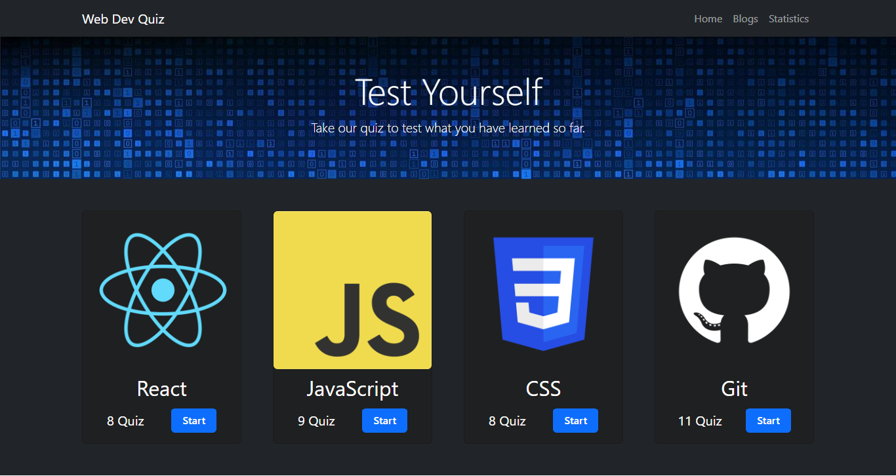

# Web Dev Quiz

## Table of contents

- [Overview](#overview)
  - [Screenshot](#screenshot)
  - [Links](#links)
- [Built with](#built-with)
- [Author](#author)

## Overview

This is an Assignment for programming hero. I have used React Routing in this project with react bootstrap and recharts. It was a fun project. 

### Screenshot

### Links

- [Solution URL](https://github.com/programming-hero-web-course2/b6-quiz-crackerz-shamratPG)
- [Live Site URL](https://github.com/shamratPG/Relief-Website)

## Built with

- Semantic HTML5 markup
- CSS3
- Bootstrap
- Java Script
- React
- React Bootstrap
- React Router
- Recharts

## Author

- Website - [Md. Shamrat Hossain](https://github.com/shamratPG)
- Twitter - [@shamratpg](https://twitter.com/shamratpg)

